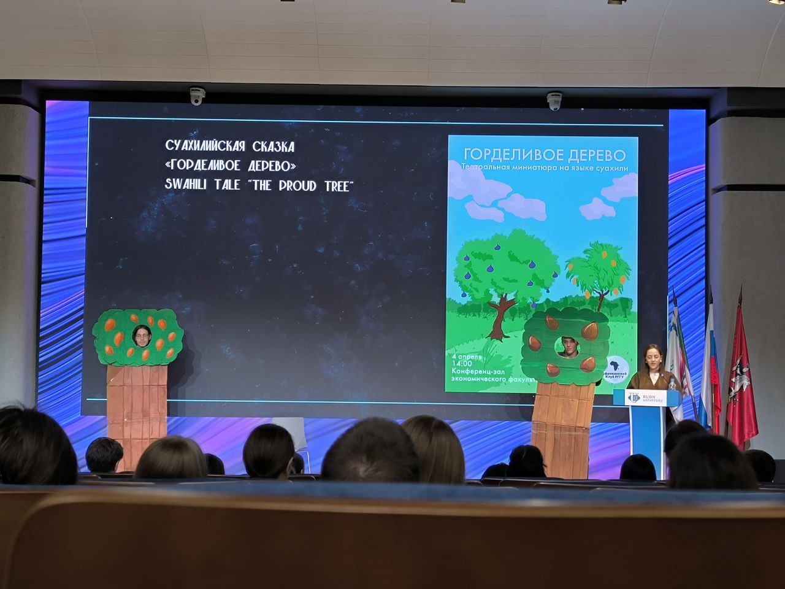

Приветствую 👋



## Сколько мне нужно было сделать на прошлой неделе?

На прошлой неделе в **пятницу в 14:30** был День культуры суахили в главном корпусе РУДН. Я посетила это мероприятие с группой в рамках модуля переводчика. Было много уважаемых гостей, которые рассказали об этой культуре и языке. Мне очень понравилось звучание суахили и сказка о горделивом дереве инжире на нем:

Также мы написали контрольную по дискретной математике.

Как обычно, я делала много домашнего задания.

[//]: # ([![The template is mobile first with a responsive design to ensure that your site looks stunning on every device.]&#40;https://raw.githubusercontent.com/wowchemy/wowchemy-hugo-modules/main/starters/academic/preview.png&#41;]&#40;https://hugoblox.com&#41;)

## Сколько я спала на прошлой неделе?

Очень сильно мало. **Внимание!** Ни в коем случае не повторяейте этого и делайте все заранее. Человек должен спать 8-9 часов в день!

## Успела ли я вовремя?

Да, я все успела, но мне еще нужно сделать доклад по архитектуре компьютеров...

