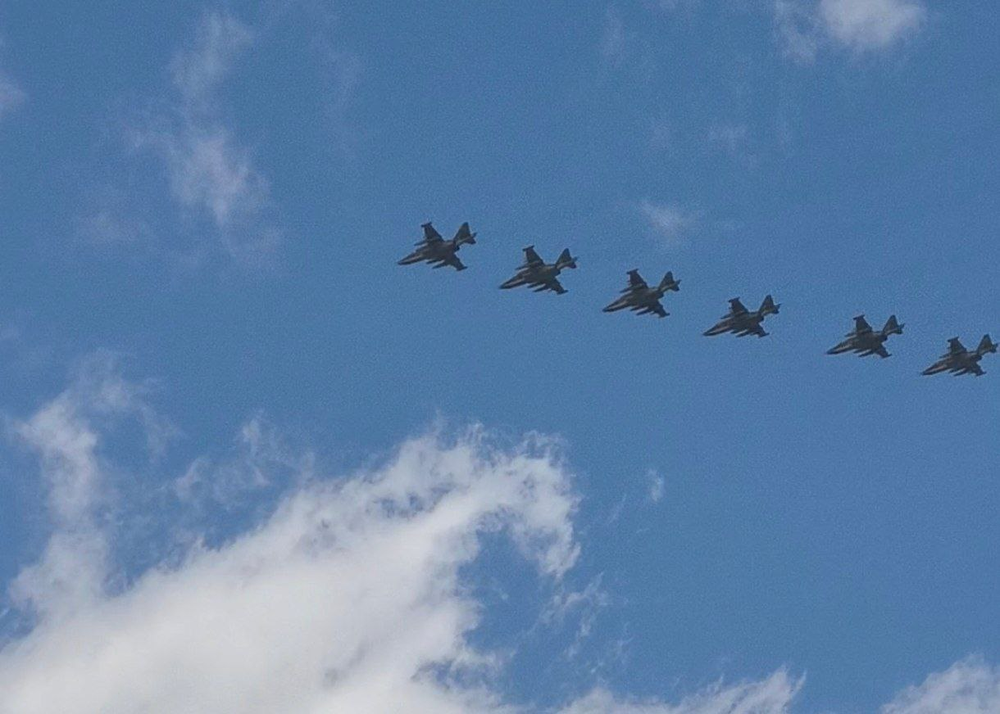

Приветствую 👋



## Что я делала на майских?

Как обычно, чем больше копятся дедлайны, тем больше ты прокрастинируешь. Я пыталась что-то делать, но диван меня манил, поэтому я спала.

[//]: # ([![The template is mobile first with a responsive design to ensure that your site looks stunning on every device.]&#40;https://raw.githubusercontent.com/wowchemy/wowchemy-hugo-modules/main/starters/academic/preview.png&#41;]&#40;https://hugoblox.com&#41;)

## Как же я видела авиацию парада?

Это было накануне Дня Победы. Я возвращалась с пар, вышла из метро на остановку, и тут слышу - начался сильный гул. Я посмотрела в небо и увидела Стрижей. Быстро достала телефон, сфотографировала и сняла видео. Дальше за ними полетели СУ-25 (вроде так, они еще флаг в конце пускают). Звук очень потрясающий.

Вот так я увидела авиационную часть парада. Они пролетели прямо надо мной.

## А как же учеба?

Ну... Что-то я сделала

